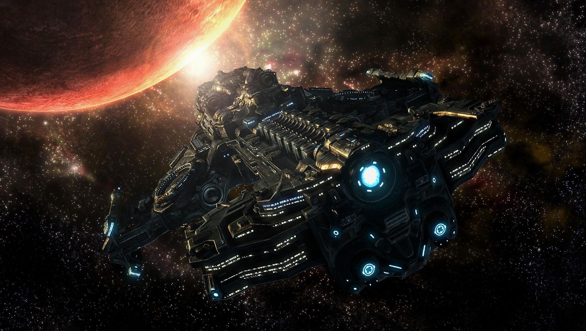
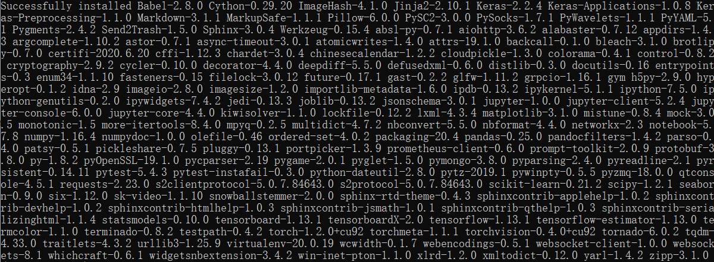
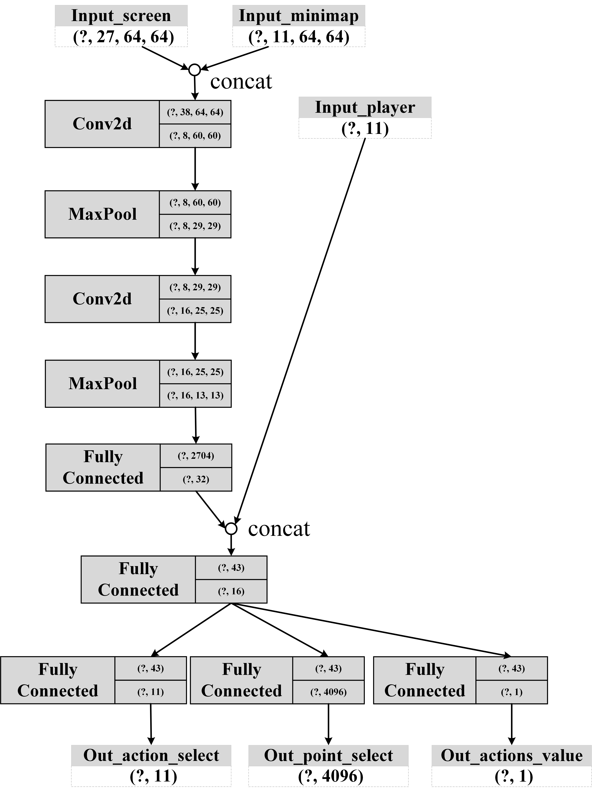

# SCII_Bots


Several agents able to play *[StarCraft II]((https://starcraft2.com/))* will be built in this repository!


### Initializing

##### Build basic develop environment

First of all, you need to download and install the game. Then follow the instructions below to build awesome battle bots!

The install packages from requirements file are all tested on windows 10, conda 4.9.2 and python 3.7.3.

Create a new conda environment with

```powershell
conda create -n SCII_Bots python=3.7.3
```

Install [git for python](https://anaconda.org/anaconda/git) with 

```powershell
conda install git
```

Install requirements with (*note that some of the packages may not need to be used*)

```powershell
pip install -r requirements.txt
```

If everything goes well, the followed result should be shown in the powershell/prompt.



PS: the newest version of [PySC2](https://github.com/deepmind/pysc2) package is 3.0.0, which most of the codes published on websites are based on 2.x.x, so most of them are no longer available to run. 

PPS: PySC2 is very different with and more complex than [python-sc2](https://github.com/Dentosal/python-sc2). In this repository, we mainly focus on PySC2.


### Learning

##### introduction of game environment 

**State**: obtained from env.observation, including the feature screen, feature minimap and player info.

**Action**: try to determine what to do and where to go to win the game. There are two types of the actions include several basic action (currently 11) and a coordinate position with 64*64 points.

**Reward**: 

<u>*version 1:*</u>
$$
(score + total\_value\_units + total\_value\_structures + 10*killed\_value\_units + 10*killed\_value\_structures + collected\_minerals + collected\_rate\_minerals + 5*spent\_minerals - 8*idle\_work\_time) * 10e-6
$$
need further adjust.

<u>*version 2:*</u>

use `*spent_minerals*` to reward the action; use `*killed_value_units + killed_value_structures*` to reward attack point.

In summary,
$$
reward = [reward_a, reward_p]
$$
where
$$
reward_a = spent\_minerals * (10e^{-2})
$$

$$
reward_p = killed\_value\_units + killed\_value\_structures
$$

In addition, the reward will adjusted further to simulate the returns from environment more precisely. 

- if action is available, actual_action is action, else expect UnboundLocalError and return actual_action as *actions.FUNCTIONS.no_op*. 

```python
if actual_action == action:
    reward_a = reward_a * 10
```

- if win in an episode:

```python
reward = list(np.array(reward) + 10000)
```

- if done is True (forces are equal in the match of each side):

```
reward = list(np.array(reward) - 5000)
```


------

Run the environment test script as follows with

```powershell
python runner_basic_test.py
```

------

Train an DQN agent to play the game with 

```powershell
python runner_dqn.py
```

I also use the supervised value network to validate if the gradient update is worked, just run with

```python
python runner_nn_test.py
```


------

Train an A2C agent to play the game with （Coming Soon）

```powershell
python runner_a2c.py
```


##### details of neural agent

The structure of **neural agent** can be trained through **DQN** algorithm is constructed as follows with pytorch 1.2.0. The [DQN algorithm](https://zhuanlan.zhihu.com/p/97856004) is expressed as follows.


The neural network model takes three different types of input tensors include 27 channels screen features, 11channels mini-map features and 11 channels player information features. 

Also, two different functional models, named as **operation model** and **warfare model**, shared several layers of the whole network and the inputs. The two models output action value and value of attack position respectively.


The structure of **A2C** neural agent is constructed as follows with pytorch 1.2.0. (**Coming soon**)




### evaluating

It costs much time but the agent does learn something like:

-  The most important, the agent has learned about how to  select army and attack (select_scv-->build_supply_deport-->build_barrack-->train marines in multiple times-->select_all_troops-->attack_point). 
-  learned to train new battle units when army is losing. 
- learning to attack specific position.


 Average learning losses after 1068 batch_pools. 


And finally,

<u>***En Taro Zeratul !!!***</u>


**TODO List:**

1. Standardize the game rules in environment;
2. Use Keyframe rather than all frame as inputs;
3. Use recurrent block to extract temporal features;
4. Optimize the attack position to select from the positions of known enemies, rather than all positions on the mini-map;
5. add residual block to reinforce the ability of image feature extraction;
6. add attention module to refine the functions in each module.

### references

> https://github.com/deepmind/pysc2
>
> https://github.com/skjb/pysc2-tutorial
>
> https://github.com/Dentosal/python-sc2
>
> https://github.com/ClausewitzCPU0/SC2AI
>
> [Home · Dentosal/python-sc2 Wiki · GitHub](https://github.com/Dentosal/python-sc2/wiki)